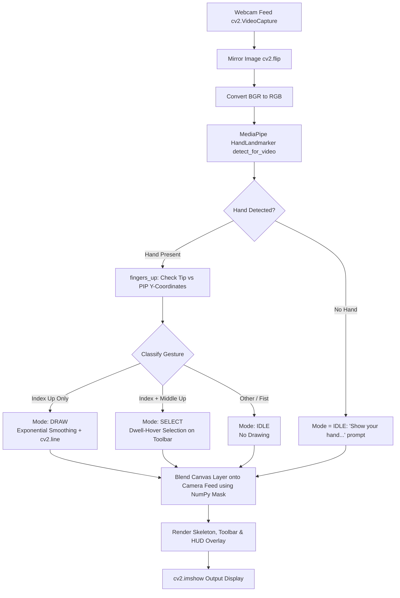

# AirDraw - Hand Gesture Controlled Virtual Canvas

> **Developed & Maintained by:** **MOHANA KRISHNA A S**  
> An interactive real-time computer vision application that allows you to draw, erase, and interact with a virtual canvas in thin air using just your webcam and hand gestures.

---

## 🌟 Overview

**AirDraw** transforms your webcam into a touchless, gesture-controlled digital drawing board. Using modern machine learning with **MediaPipe Tasks Vision API** and **OpenCV**, it detects 21 hand landmarks in real time and classifies your finger postures into intuitive controls. 

No mouse, no stylus, no physical touchscreen required—just your natural hand movements!

---

## ✨ Features

- **Gesture-Driven Drawing (`DRAW` Mode)**:
  - Point your **index finger up** to draw smooth lines directly onto the screen.
  - Automatically draws beneath the top navigation toolbar.
- **Interactive Top Toolbar (`SELECT` Mode)**:
  - Raise both your **index and middle fingers** (peace / victory gesture) to act as a hover cursor.
  - Features an intuitive **dwell-click system**: hover over any button for ~0.9 seconds to select it with visual progress feedback.
- **Rest & Repositioning (`IDLE` Mode)**:
  - Form a **fist** or open your palm to reposition your hand freely across the canvas without drawing accidental lines.
- **Exponential Jitter Smoothing**:
  - Incorporates an exponential moving average (EMA) filter on fingertip coordinates ($\alpha = 0.55$) to eliminate hand tremors and deliver crisp, clean brushstrokes.
- **Full Color Palette**:
  - Select between 7 vibrant colors: **Blue, Green, Red, Yellow, Purple, Cyan, White**.
- **Dynamic Brush & Eraser**:
  - Adjustable brush size ranging from **2px** up to **40px**.
  - Built-in dedicated eraser with a $4\times$ size multiplier for quick corrections.
- **Multi-Level Undo & Redo**:
  - Deep history stack (up to 25 states) allowing you to undo or redo mistakes instantly.
- **Canvas Clear & Snapshot Export**:
  - Clear the screen with a single action.
  - Save your artwork anytime as a high-resolution timestamped PNG (`airdraw_YYYYMMDD_HHMMSS.png`).
- **Real-Time Heads-Up Display (HUD)**:
  - Real-time FPS counter.
  - Current mode indicator (`DRAW`, `SELECT`, `IDLE`).
  - Active color and brush size preview chip.
  - On-screen guidance prompts when your hand moves out of camera range.

---

## 🖐️ Hand Gesture Guide

AirDraw identifies your hand gestures automatically using 3D knuckle-to-tip landmark geometry:

| Gesture | Finger Configuration | Mode | Description |
| :---: | :--- | :---: | :--- |
| ☝️ | **Index Finger Up Only**<br>*(Thumb/Middle/Ring/Pinky folded)* | **`DRAW`** | Draws lines following the tip of your index finger. |
| ✌️ | **Index + Middle Fingers Up**<br>*(Ring & Pinky folded)* | **`SELECT`** | Hover cursor mode. Move over top toolbar buttons to trigger actions. |
| ✊ / 🖐️ | **Fist or Full Open Palm** | **`IDLE`** | Repositioning mode. Moves cursor without drawing or clicking buttons. |

---

## ⌨️ Keyboard Shortcuts

Prefer keyboard controls? AirDraw supports full keyboard interactivity alongside gestures:

| Key | Action | Description |
| :---: | :--- | :--- |
| `1` – `7` | **Color Select** | `1` Blue, `2` Green, `3` Red, `4` Yellow, `5` Purple, `6` Cyan, `7` White |
| `E` | **Eraser** | Switches to eraser mode |
| `D` | **Draw Mode** | Switches back from eraser to your last selected color |
| `+` / `=` | **Increase Size** | Increases brush diameter by +2px (up to 40px) |
| `-` | **Decrease Size** | Decreases brush diameter by -2px (down to 2px) |
| `U` | **Undo** | Reverts the last completed stroke |
| `R` | **Redo** | Restores the previously undone stroke |
| `C` | **Clear** | Clears the entire canvas |
| `S` | **Save** | Exports the current canvas as a `.png` file in the project folder |
| `Q` | **Quit** | Safely exits the application and releases the webcam |

---

## 🏗️ System Architecture & Workflow



---

## 📦 Prerequisites & Installation

### 1. Requirements
- Python 3.9, 3.10, 3.11, 3.12, or 3.14 (with MediaPipe Tasks support)
- A working webcam

### 2. Clone / Open Directory
Open your terminal (PowerShell or Command Prompt) and navigate to the project directory:

```powershell
cd "C:\Users\mohan\OneDrive\Desktop\air draw\airdraw-project-main\airdraw-project-main"
```

### 3. Install Dependencies
Install the required packages using pip:

```powershell
py -m pip install -r requirements.txt
```

*Required packages:*
- `opencv-python>=4.8.0`
- `mediapipe>=0.10.0`
- `numpy>=1.24.0`

---

## 🚀 How to Run

From inside the project directory:

```powershell
py airdraw.py
```

> **Note on Model Download:**  
> On the very first run, if `hand_landmarker.task` is not found, the script will automatically download Google's official MediaPipe Hand Landmarker model (~7.8 MB) into the project folder.

---

## 📁 Project Structure

```
airdraw-project-main/
│
├── airdraw.py             # Main application logic, UI, and gesture loop
├── hand_landmarker.task   # MediaPipe pretrained 21-hand-landmark model asset
├── requirements.txt       # Python package dependencies
├── setup_windows.bat      # Windows automated virtual environment setup script
├── setup_unix.sh          # Linux/macOS automated setup script
├── README.md              # Project documentation (by MOHANA KRISHNA A S)
└── LICENSE                # License information
```

---

## 👤 Author & Acknowledgments

- **Lead Developer**: **MOHANA KRISHNA A S**
- **Core Technologies**: Python, OpenCV, Google MediaPipe, NumPy
